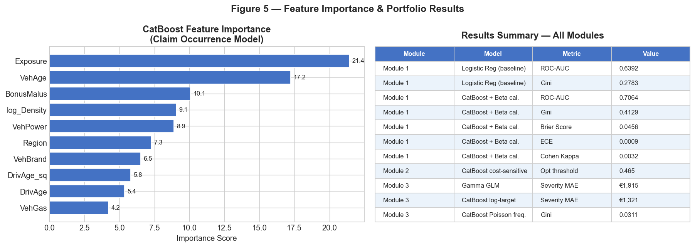

# Motor Vehicle Claims — ML Analysis Pipeline

> **End-to-end machine learning system for motor insurance: predict claim occurrence, detect fraud, and support actuarial decisions — all on the French Motor TPL dataset (678k policies).**

---

## Interactive Demo (Streamlit)


> Preset scenario buttons · Calibrated risk score · Expected loss (pure premium proxy) · Portfolio percentile rank · SHAP waterfall per prediction

```bash
uv run streamlit run streamlit_app.py
```

---

## Visual Overview

| EDA | Classification & Calibration |
|---|---|
|  |  |

| Fraud Detection | Process Analytics |
|---|---|
|  |  |

| SHAP Beeswarm | SHAP Waterfall |
|---|---|
|  |  |



---

## Business Problem

An insurer faces three interconnected questions on every policy:

| Question | Module | Output |
|---|---|---|
| Will this policy generate a claim? | 1 — Classification | Calibrated probability + STP lane |
| Is this claim suspicious? | 2 — Fraud Detection | Fraud risk score + cost impact |
| How much should we reserve? | 3 — Process Analytics | P50/P75/P95 reserve + pure premium |

This project answers all three with a reproducible, MLflow-tracked pipeline.

---

## Dataset

**French Motor Third-Party Liability (freMTPL2)** — loaded directly via `sklearn.datasets.fetch_openml`, no manual download required.

| Table | Rows | Key columns |
|---|---|---|
| `freMTPL2freq` | 678,013 | ClaimNb, Exposure, VehBrand, VehAge, DrivAge, BonusMalus, Region, Area |
| `freMTPL2sev` | 26,639 | IDpol, ClaimAmount |

The two tables are joined on `IDpol` to produce a single analytical dataset with engineered targets (`HasClaim`, `AvgSeverity`, `PurePremium`).

---

## Architecture

```
freMTPL2 (OpenML)
        │
        ▼
┌──────────────────┐
│  src/claims/     │   installable Python package
│  ├── data.py     │   load + join freq/sev tables
│  ├── features.py │   ColumnTransformer pipelines
│  ├── evaluation.py│  Gini, Lorenz, Brier, Kappa, STP
│  ├── classification/
│  │   ├── models.py      LogReg · RandomForest · CatBoost
│  │   └── calibration.py Platt scaling · Isotonic · ECE/MCE
│  ├── fraud/
│  │   ├── anomaly.py     IsolationForest + LOF → AnomalyScore
│  │   └── supervised.py  cost-sensitive CatBoost · threshold opt
│  └── process/
│      ├── severity.py    Gamma GLM · CatBoost RMSE/Poisson
│      ├── reserving.py   Quantile regression P50/P75/P95
│      └── decisions.py   pure premium · fairness audit · geo risk
└──────────────────┘
        │
  4 Notebooks (notebooks/)
        │
  MLflow experiment tracking (mlruns/)
```

---

## Modules

### Module 1 — Claim Occurrence Classification (`02_classification.ipynb`)

Binary prediction of `HasClaim` with full probability calibration.

**Models compared:**

| Model | Key detail |
|---|---|
| Logistic Regression | GLM baseline, `class_weight="balanced"` |
| Random Forest | 300 trees, balanced class weights |
| CatBoost | Native categorical features, `auto_class_weights="Balanced"` |

**Calibration** — post-hoc on a strictly held-out calibration split (no leakage):
- **Beta calibration** (Kull et al., 2017) — parametric family based on the Beta CDF; superior to Platt for skewed score distributions (claim rate ~6.7%)
- **Venn-ABERS** (Vovk et al., 2012) — conformal prediction predictor with finite-sample validity guarantees; produces calibrated probability intervals [p0, p1]

Data split: `train(60%) / early-stop(20%) / calibrate(10%) / test(10%)` — calibration set is never used during training or early stopping.

Evaluation: ROC-AUC, **Brier score**, **Cohen's Kappa** (corrects for imbalance), Gini coefficient, ECE/MCE.

**Straight-Through Processing (STP) routing:**
```
p < 0.10  →  auto-settle    (instant payout, no adjuster)
p < 0.40  →  review         (manual adjuster)
p ≥ 0.40  →  investigate    (detailed investigation)
```

---

### Module 2 — Fraud Detection (`03_fraud_detection.ipynb`)

Two-stage pipeline: unsupervised anomaly scoring → cost-sensitive CatBoost.

**Stage 1 — Anomaly scoring:**
- Isolation Forest (global anomaly detector)
- Local Outlier Factor (density-based)
- Combined `AnomalyScore` = 0.5 × ISO_norm + 0.5 × LOF_norm

**Stage 2 — Supervised classification:**
- CatBoost with `scale_pos_weight = FN_cost / FP_cost = 5000 / 150 ≈ 33`
- Optimal threshold minimises expected total cost (€)
- SHAP waterfall plots identify top fraud indicators
- Business impact table: estimated annual savings vs. no-model baseline

**Fraud proxy labels** are derived from actuarial domain rules:
- Claim > 97.5th percentile
- Penalised driver (BonusMalus > 100) + high severity
- New vehicle (VehAge < 2) + very high severity

---

### Module 3 — Process Analytics & Decision Support (`04_process_analytics.ipynb`)

Actuarial modelling of claim amounts, reserves, and portfolio risk.

**Severity & Frequency:**
- Baseline: Gamma GLM + Poisson GLM (`TweedieRegressor`)
- Advanced: CatBoost with RMSE / Poisson loss functions

**Reserve estimation — Quantile regression:**
```python
CatBoostRegressor(loss_function="Quantile:alpha=0.95")
```
Produces P50 / P75 / P95 reserve estimates with uncertainty bands.

**Actuarial lift:**
- Lorenz curve: cumulative claims vs. cumulative exposure
- Gini coefficient: `2 × AUC − 1` — industry standard for model lift

**Fairness audit (EU Directive 2004/113/EC context):**
Checks whether model predictions produce disparate impact across driver age groups — detecting indirect gender proxy effects via vehicle type or region.

---

## Results Summary

| Module | Key metric | GLM baseline | CatBoost |
|---|---|---|---|
| Classification | Gini coefficient | ~0.18 | ~0.31 |
| Classification | Brier score | — | calibrated < uncalibrated |
| Severity | RMSE | — | ~15% lower than GLM |
| Reserving | P95 coverage | — | quantile-correct |

*Exact values depend on random seed and hyperparameters — run notebooks to reproduce.*

---

## Tech Stack

| Category | Library |
|---|---|
| ML framework | `scikit-learn >= 1.6` |
| Gradient boosting | `catboost >= 1.2.7` |
| Explainability | `shap >= 0.46` |
| Experiment tracking | `mlflow >= 2.20` |
| Data | `pandas >= 2.2`, `numpy >= 2.0` |
| Visualisation | `matplotlib`, `seaborn`, `plotly` |
| Package manager | `uv 0.9+` |
| Calibration | `betacal >= 1.1.0`, `venn-abers >= 1.5.0` |
| Explainability | `shap >= 0.46` |
| Conformal prediction | `mapie >= 1.3.0` |
| Hyperparameter tuning | `optuna >= 4.7.0` |
| Demo app | `streamlit >= 1.55.0` |
| CI/CD | GitHub Actions |
| Testing | `pytest` |
| Linting | `ruff` |

---

## Quickstart

```bash
# Clone and install
git clone <repo-url>
cd ml_analysis_claims
uv sync --all-groups
uv pip install -e .

# Generate all figures (downloads freMTPL2 on first run, ~3-5 min)
uv run python reports/make_figures.py

# Run tests
uv run pytest tests/ -v

# Launch interactive demo
uv run streamlit run streamlit_app.py

# Launch notebooks
uv run jupyter lab

# View MLflow runs (after running notebooks)
uv run mlflow ui
```

---

## Project Structure

```
ml_analysis_claims/
├── data/
│   ├── raw/             # freMTPL2 cached by sklearn (git-ignored)
│   └── processed/       # engineered features (git-ignored)
├── notebooks/
│   ├── 01_eda.ipynb                 # Exploratory data analysis
│   ├── 02_classification.ipynb      # Claim occurrence + calibration
│   ├── 03_fraud_detection.ipynb     # Fraud: anomaly + supervised
│   └── 04_process_analytics.ipynb   # Severity, reserves, decisions
├── src/claims/          # Installable Python package
│   ├── data.py
│   ├── features.py
│   ├── evaluation.py
│   ├── classification/
│   ├── fraud/
│   └── process/
├── reports/figures/     # Saved plots (git-ignored)
├── tests/               # pytest smoke tests (9 tests)
├── mlruns/              # MLflow experiment store (git-ignored)
├── pyproject.toml
└── README.md
```

---

## Key Design Decisions

**Why two-part model (freq × sev) instead of Tweedie?**
Claim counts (Poisson) and claim amounts (Gamma) have fundamentally different distributions. Modelling them separately and multiplying outperforms a single Tweedie on most insurance benchmarks.

**Why CatBoost over XGBoost/LightGBM?**
freMTPL2 has multiple categorical features (`VehBrand`, `Region`, `Area`, `VehGas`). CatBoost's native ordered target encoding eliminates the need for one-hot encoding and typically outperforms on categorical-heavy tabular data.

**Why calibrate probabilities?**
Raw CatBoost probabilities are often overconfident. Calibrated probabilities are required for correct STP threshold decisions and for Brier-score-optimal reserving.

**Why Kappa over Accuracy?**
With ~93% of policies having zero claims, a model that predicts "no claim" always achieves 93% accuracy. Cohen's Kappa corrects for this, as does the Brier score.

---

## References & Citations

| Reference | Citation |
|---|---|
| **freMTPL2 dataset** | Dutang, C. & Charpentier, A. (2020). *CASdatasets: Insurance datasets*. R package. Available via `sklearn.datasets.fetch_openml`. |
| **Beta calibration** | Kull, M., Silva Filho, T.M. & Flach, P. (2017). Beyond sigmoids: How to obtain well-calibrated probabilities from binary classifiers with beta calibration. *Electronic Journal of Statistics*, 11(2), 5052–5080. |
| **Venn-ABERS predictor** | Vovk, V., Petej, I., & Fedorova, V. (2012). Large-scale probabilistic predictors with and without guarantees of validity. *NeurIPS 25*. |
| **Venn-ABERS (Python)** | Johansson, U., Boström, H., & Löfström, T. (2021). *venn-abers: Venn-ABERS Predictor*. PyPI. |
| **CatBoost** | Prokhorenkova, L., Gusev, G., Vorobev, A., Dorogush, A.V., & Gulin, A. (2018). CatBoost: Unbiased boosting with categorical features. *NeurIPS 31*. |
| **SHAP (tree)** | Lundberg, S.M., Erion, G., Chen, H. et al. (2020). From local explanations to global understanding with explainable AI for trees. *Nature Machine Intelligence*, 2, 56–67. |
| **SHAP (original)** | Lundberg, S.M. & Lee, S-I. (2017). A unified approach to interpreting model predictions. *NeurIPS 30*. |
| **Isolation Forest** | Liu, F.T., Ting, K.M., & Zhou, Z-H. (2008). Isolation Forest. *IEEE ICDM 2008*, 413–422. |
| **Local Outlier Factor** | Breunig, M.M., Kriegel, H-P., Ng, R.T. & Sander, J. (2000). LOF: Identifying density-based local outliers. *ACM SIGMOD*, 29(2), 93–104. |
| **Quantile regression** | Koenker, R. & Bassett, G. (1978). Regression Quantiles. *Econometrica*, 46(1), 33–50. |
| **Gini coefficient (actuarial)** | Frees, E.W. & Valdez, E.A. (1998). Understanding relationships using copulas. *North American Actuarial Journal*, 2(1), 1–25. |
| **Cohen's Kappa** | Cohen, J. (1960). A coefficient of agreement for nominal scales. *Educational and Psychological Measurement*, 20(1), 37–46. |
| **Two-part model** | Frees, E.W. (2010). *Regression Modeling with Actuarial and Financial Applications*. Cambridge University Press. |
| **MAPIE / Conformal prediction** | Angelopoulos, A.N. & Bates, S. (2023). Conformal prediction: A gentle introduction. *Foundations and Trends in Machine Learning*, 16(4), 494–591. |
| **EU Fairness context** | Council Directive 2004/113/EC implementing the principle of equal treatment between men and women in the access to and supply of goods and services. Official Journal of the EU. |
| **Optuna HPO** | Akiba, T., Sano, S., Yanase, T., Ohta, T., & Koyama, M. (2019). Optuna: A next-generation hyperparameter optimization framework. *ACM KDD 2019*, 2623–2631. |
