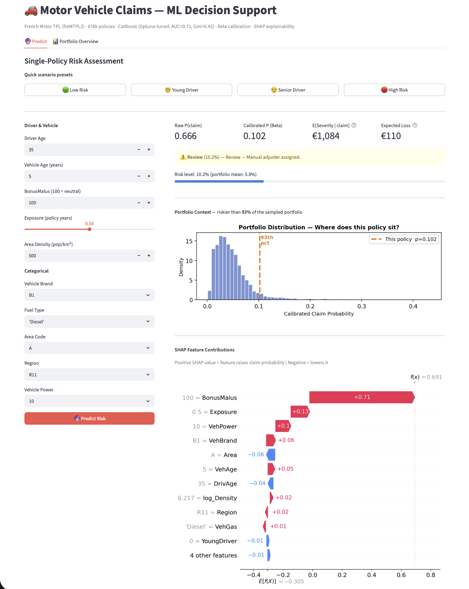
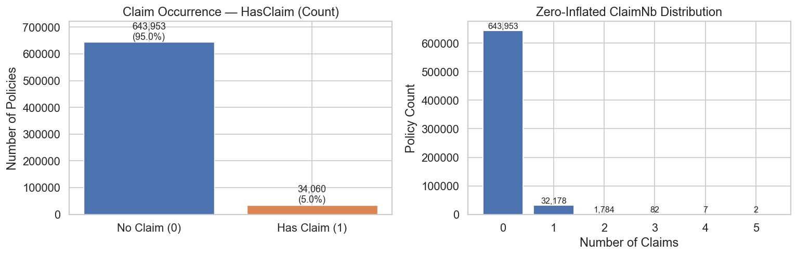
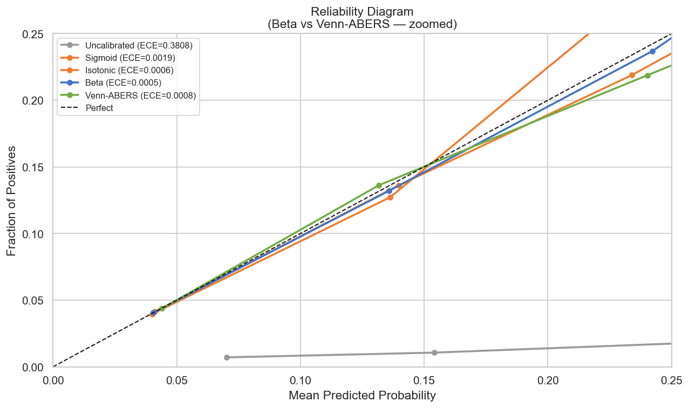
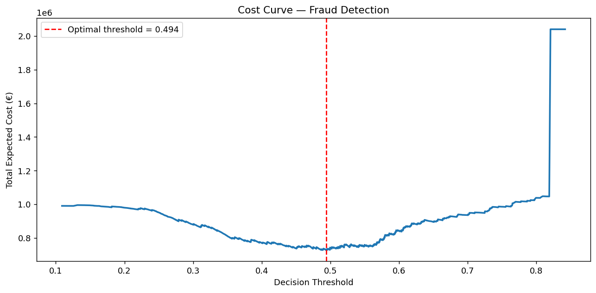
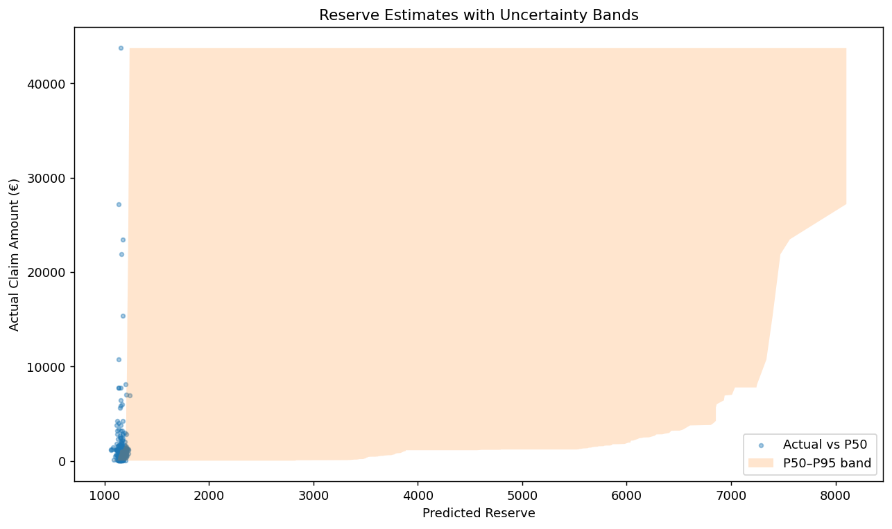
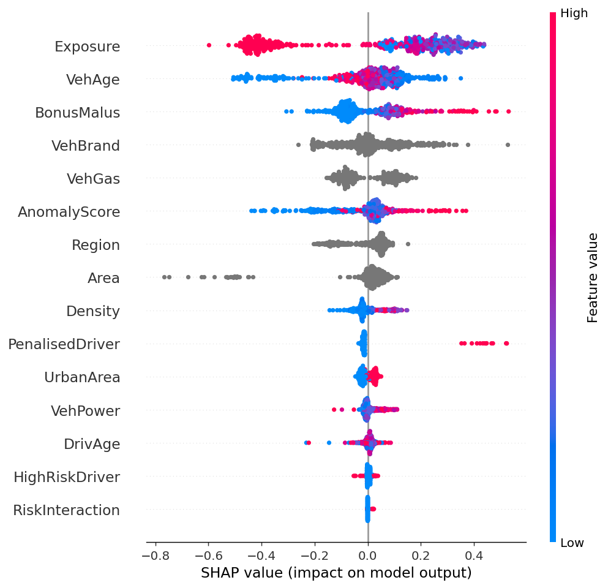
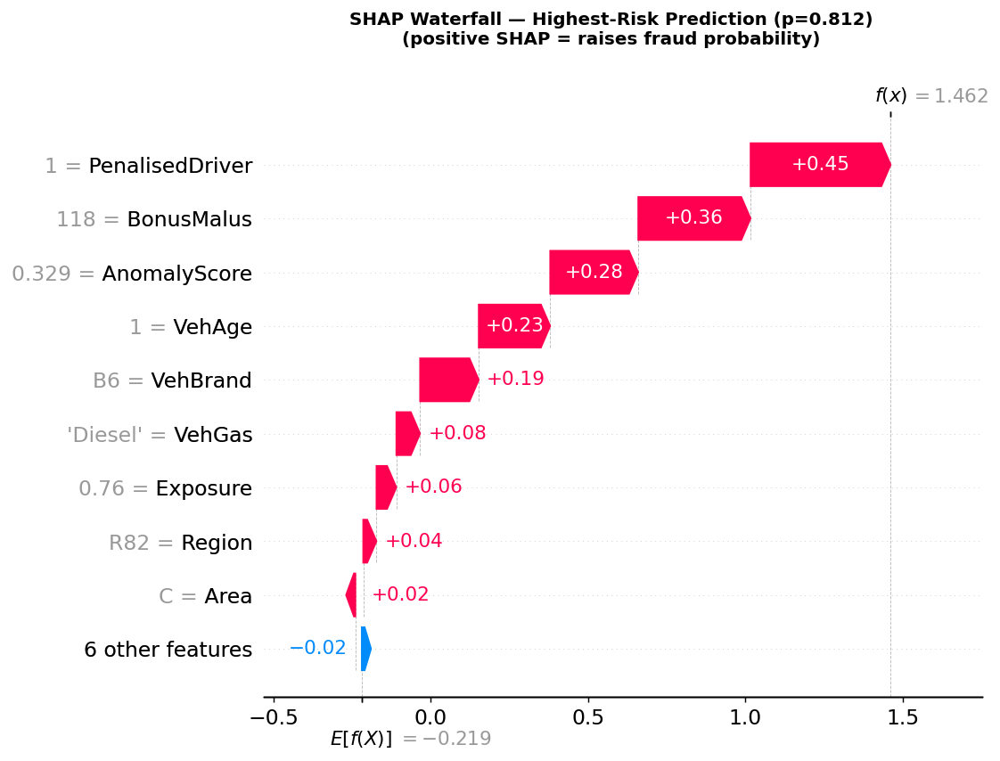
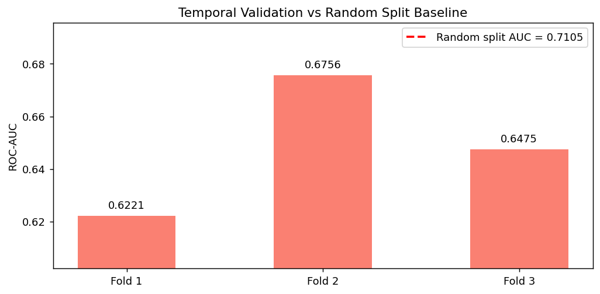

# Motor Vehicle Claims — ML Analysis Pipeline

Three-module ML system for French motor insurance built on the freMTPL2 dataset (678k policies). Each module answers a distinct business question at a different point in the claim lifecycle:

- **Module 1 — Classification**: *Will this policy generate a claim?* Used at underwriting for risk pricing and STP routing when a claim is filed.
- **Module 2 — Fraud Detection**: *Is this filed claim suspicious?* Applied at claim triage to prioritise investigator workload.
- **Module 3 — Process Analytics**: *How much will this claim cost?* Drives reserve estimation and pure premium pricing.

CatBoost achieves **ROC-AUC 0.709 and ECE 0.0005** on the held-out test set after Beta calibration; the severity model reduces MAE by **31% against a Gamma GLM baseline**; the fraud model delivers **€322,800 in estimated cost savings** vs. a flag-nothing baseline.

---

## Key Results

### Module 1 — Classification

| Model | ROC-AUC ↑ | Gini ↑ | Brier ↓ | ECE ↓ |
|---|---|---|---|---|
| Logistic Regression | 0.642 | 0.283 | 0.235 | 0.423 |
| Random Forest | 0.693 | 0.386 | 0.220 | 0.463 |
| CatBoost (uncalibrated) | 0.709 | 0.418 | 0.209 | 0.384 |
| CatBoost + Sigmoid | 0.708 | 0.415 | 0.046 | 0.002 |
| CatBoost + Isotonic | 0.707 | 0.415 | 0.046 | 0.001 |
| **CatBoost + Beta** | **0.708** | **0.415** | **0.046** | **0.0005** |
| CatBoost + Venn-ABERS | 0.662 | 0.325 | 0.047 | 0.001 |

*Held-out test set (67,802 policies). Beta and Isotonic calibration preserve AUC because they are monotone transformations of the raw scores — ranking order is unchanged, only probabilities are corrected. Venn-ABERS is not monotone (it interpolates between two isotonic fits), so it improves calibration but at a −0.047 AUC cost. Cohen's κ is omitted for calibrated models: at a 5% base rate, calibrated probabilities are almost never above the default 0.5 decision threshold, so κ at that threshold is not a meaningful comparison.*

### Module 2 — Fraud Detection

| Metric | Value |
|---|---|
| ROC-AUC | 0.689 |
| Gini | 0.378 |
| Top-decile fraud capture | 26.2% of fraud proxies |
| Estimated cost savings vs. flag-nothing | **€322,800** |

*Cost matrix: FN (missed fraud) = €5,000, FP (false alert) = €150. The model catches 150 true fraud proxies, triggers 2,848 false alerts, and misses 60 — totalling €727,200 vs. €1,050,000 baseline. Note: freMTPL2 has no ground-truth fraud labels; proxy labels are defined by severity percentile and driver profile — see [Fraud Detection](#module-2--fraud-detection-1) for the caveat.*

### Module 3 — Severity

| Model | MAE ↓ | RMSE ↓ | Notes |
|---|---|---|---|
| Gamma GLM | €1,915 | €7,926 | log-link, distribution-based |
| **CatBoost (log1p target)** | **€1,321** | **€7,977** | **31% MAE improvement** |

---

## Interactive Demo



> Preset scenarios · Calibrated risk score · Expected loss · Portfolio percentile rank · SHAP waterfall per prediction

```bash
uv run streamlit run streamlit_app.py
```

---

## Table of Contents

1. [Dataset](#dataset)
2. [Project Structure](#project-structure)
3. [Pipeline](#pipeline)
4. [EDA Findings](#eda-findings)
5. [Modelling](#modelling)
6. [SHAP Interpretability](#shap-interpretability)
7. [Temporal Validation](#temporal-validation)
8. [Business Recommendations](#business-recommendations)
9. [Design Decisions](#design-decisions)
10. [How to Run](#how-to-run)
11. [References](#references)

---

## Dataset

**French Motor Third-Party Liability (freMTPL2)** — loaded directly from OpenML via `sklearn.datasets.fetch_openml`, no manual download required.

| Table | Rows | Key columns |
|---|---|---|
| `freMTPL2freq` | 678,013 | ClaimNb, Exposure, VehBrand, VehAge, DrivAge, BonusMalus, Region, Area |
| `freMTPL2sev` | 26,639 | IDpol, ClaimAmount |

Joined on `IDpol` to produce a single analytical dataset.

**Engineered targets:**

| Column | Definition |
|---|---|
| `HasClaim` | 1 if ClaimNb ≥ 1, else 0 |
| `ClaimFrequency` | ClaimNb / Exposure |
| `AvgSeverity` | total ClaimAmount / ClaimNb (claims-only rows) |
| `PurePremium` | ClaimFrequency × AvgSeverity |

**Engineered features:**

| Feature | Formula | Rationale |
|---|---|---|
| `log_Density` | log1p(Density) | Corrects heavy right tail |
| `DrivAge_sq` | DrivAge² | Captures U-shaped risk curve |
| `BM_excess` | max(BonusMalus − 100, 0) | Penalised amount above neutral |
| `YoungDriver` | DrivAge < 25 | High-risk segment indicator |
| `SeniorDriver` | DrivAge > 70 | High-risk segment indicator |
| `NewVehicle` | VehAge < 2 | Higher theft / total-loss probability |

**Data split:**

| Set | Share | Policies | Claim rate | Purpose |
|---|---|---|---|---|
| Train | 60% | 407,010 | 5.02% | Model fitting |
| Early-stop | 20% | 101,600 | 5.02% | CatBoost early stopping only |
| Calibrate | 10% | 101,601 | 5.02% | Calibration fitting — never seen during training |
| Test | 10% | 67,802 | 5.02% | Final evaluation — untouched until reporting |

The 4-way split is a deliberate rigidity: each stage gets its own exclusive data so that no information leaks between training, early stopping, calibration, and evaluation.

---

## Project Structure

```
ml_analysis_claims/
├── pyproject.toml
├── config.yaml                   # Optuna-tuned CatBoost hyperparameters
├── streamlit_app.py              # Interactive prediction demo
├── .github/workflows/ci.yml     # GitHub Actions: pytest on push / PR
├── src/claims/
│   ├── config.py                # Hyperparameter dataclasses
│   ├── data.py                  # load_fremtpl2, build_claims_dataset, splits
│   ├── features.py              # ColumnTransformer pipelines, feature engineering
│   ├── evaluation.py            # Gini, Lorenz, Brier, Kappa, STP routing
│   ├── classification/
│   │   ├── models.py            # LogReg, RandomForest, CatBoost constructors
│   │   ├── calibration.py      # Beta calibration, Venn-ABERS, ECE/MCE, reliability diagram
│   │   └── tuning.py           # Optuna hyperparameter search for CatBoost / LogReg
│   ├── fraud/
│   │   ├── anomaly.py           # IsolationForest + LOF → combined AnomalyScore
│   │   └── supervised.py       # Cost-sensitive CatBoost, threshold optimisation, business impact
│   └── process/
│       ├── severity.py          # Gamma GLM, CatBoost (log1p target), Poisson GLM
│       ├── reserving.py         # Quantile regression P50 / P75 / P95
│       └── decisions.py        # Pure premium, fairness audit, geographic risk
├── notebooks/
│   ├── 01_eda.ipynb
│   ├── 02_classification.ipynb
│   ├── 03_fraud_detection.ipynb
│   ├── 04_process_analytics.ipynb
│   └── 05_temporal_validation.ipynb
├── reports/
│   └── figures/                 # 29 PNG outputs generated by notebooks (tracked for display)
└── tests/
    └── test_core.py             # 23 unit tests
```

---

## Pipeline

The three modules are independent models that address different business questions. In a live system they operate at different stages of the claim lifecycle — but all are trained on the same freMTPL2 dataset, making this a useful single-dataset benchmark.

```
freMTPL2 (OpenML)
        │
        ▼
  engineer_features()         log_Density, DrivAge_sq, BM_excess,
                               YoungDriver, SeniorDriver, NewVehicle
        │
        ├──► Module 1: Classification        (at policy inception / claim routing)
        │     4-way split → CatBoost (Optuna-tuned: 866 iter, lr=0.088, depth=7)
        │     → Beta calibration on held-out cal set
        │     → Venn-ABERS calibration (conformal prediction family)
        │     → STP routing at claim filing (auto-settle / review / investigate)
        │     → Temporal walk-forward validation (3 folds)
        │
        ├──► Module 2: Fraud Detection       (at claim triage)
        │     claims_only() → IsoForest + LOF → AnomalyScore
        │     → cost-sensitive CatBoost (FN/FP cost ratio = 33)
        │     → threshold optimisation → business impact table
        │
        └──► Module 3: Process Analytics     (at claim reservation)
              severity:   Gamma GLM + CatBoost (log1p target)
              frequency:  Poisson GLM + CatBoost (Poisson loss)
              reserves:   Quantile regression P50 / P75 / P95
              → pure premium (freq × sev) → Lorenz curve → Gini lift
```

---

## EDA Findings



### Claim Rate: Heavily Zero-Inflated

5.02% of policies generate a claim — a 19:1 class ratio. Of those with claims, 97.5% have exactly one. Models that predict "no claim" for every policy achieve ~95% accuracy; this is why **Cohen's Kappa** and **Brier Score** supplement AUC as metrics. The Gini coefficient (2 × AUC − 1) is the industry-standard measure of actuarial model lift — it measures how well the model ranks risks relative to a random ordering, which directly determines the quality of pricing segmentation.

### BonusMalus: The Strongest Signal

The BonusMalus distribution is strongly right-skewed and concentrated at or below the neutral point (100). Penalised drivers (BM > 100) show 2–3× the baseline claim rate. The engineered `BM_excess = max(BM − 100, 0)` feature isolates this penalised exposure, and SHAP confirms BonusMalus as the top feature across both the classification and fraud models.

### Driver Age: U-Shaped Risk Curve

Drivers under 25 and over 70 show elevated claim rates, consistent with the insurance industry's well-documented age-risk relationship. `DrivAge_sq` captures this non-linearity that linear models cannot represent with the raw feature alone — the AUC improvement from LogReg (0.642) to CatBoost (0.709) is partly explained by CatBoost's ability to discover this interaction without the engineered feature.

### Claim Severity: Heavy Right Tail

The severity distribution is extremely right-skewed — the top 5% of claims account for a disproportionate share of total loss. This motivates modelling severity on a log scale (see Module 3), rather than fitting on raw amounts where outliers dominate the loss function.

---

## Modelling

### Module 1 — Claim Occurrence Classification



**Why calibration matters here:** CatBoost raw scores are well-ranked (AUC 0.709) but poorly calibrated (ECE 0.384) — the probabilities are systematically too high across the board. STP routing and reserve pricing both require *accurate probabilities*, not just good rankings, so post-hoc calibration is essential.

**Post-hoc calibration on the held-out calibration set:**

| Method | ECE before | ECE after | Improvement | AUC preserved? |
|---|---|---|---|---|
| Beta calibration [[1]](#references) | 0.384 | 0.0005 | ~760× | Yes — monotone transform |
| Isotonic regression | 0.384 | 0.001 | ~480× | Yes — monotone transform |
| Sigmoid (Platt) | 0.384 | 0.002 | ~190× | Yes — monotone transform |
| Venn-ABERS [[2]](#references) | 0.384 | 0.001 | ~480× | No — AUC drops to 0.662 |

Beta is selected as the production calibrator: it achieves the lowest ECE (0.0005) without any AUC cost.

**Why Venn-ABERS loses AUC:** Beta, Isotonic, and Sigmoid calibration are all monotone transformations of the raw score — they correct the probability values without changing which predictions are ranked higher than others, so AUC is identical before and after. Venn-ABERS is not monotone: it fits two separate isotonic regressions (one per class) and returns their midpoint, which can reorder predictions. The result is stronger theoretical calibration guarantees but a −0.047 AUC regression that makes it unsuitable as a primary model.

**Straight-Through Processing (STP) routing** at claim filing, using calibrated probability:

```
p < 0.10  →  auto-settle    (92.6% of claims; claim rate 4.1%)
0.10–0.40 →  review          (7.3% of claims;  claim rate 16.8%)
p ≥ 0.40  →  investigate     (0.1% of claims;  claim rate 35.5%)
```

The thresholds are not calibrated to a cost objective here — they are illustrative decision bands showing how a monotonically increasing claim rate across lanes confirms the model's discriminative power at routing time.

### Module 2 — Fraud Detection



**Important caveat:** freMTPL2 contains no ground-truth fraud labels. Fraud proxies are constructed from claim severity percentile and driver risk profile — the model learns to predict these rules back, which is useful as a methodological demonstration but should not be interpreted as validated fraud detection performance. In production, investigator outcome labels would replace the proxies.

Two-stage pipeline: unsupervised anomaly scoring feeds into cost-sensitive supervised classification.

**Stage 1 — Anomaly scoring** (claims-only subset):

Isolation Forest [[5]](#references) and Local Outlier Factor [[6]](#references) each produce a normalised outlier score on numeric claim features. Their average becomes `AnomalyScore` — a single feature capturing multivariate anomalousness without requiring labels. Running on claims-only data avoids contaminating the anomaly model with the large majority of zero-claim policies.

**Fraud proxy labels** (constructed in absence of ground truth):
- Claim above the 97.5th percentile of severity
- Penalised driver (BonusMalus > 100) + high severity
- New vehicle (VehAge < 2) + very high severity

**Stage 2 — Cost-sensitive CatBoost:**

`scale_pos_weight = FN_cost / FP_cost = €5,000 / €150 ≈ 33`

A missed fraudulent claim costs 33× more than a false alert. The decision threshold is optimised against total expected cost — not accuracy or F1, which are inappropriate when the cost asymmetry is this severe.

**Business impact at optimal threshold (0.494):**

| | Count | Cost |
|---|---|---|
| True positives (fraud caught) | 150 | — |
| False positives (false alerts) | 2,848 | €427,200 |
| False negatives (missed fraud) | 60 | €300,000 |
| **Total model cost** | | **€727,200** |
| Baseline (flag nothing) | | €1,050,000 |
| **Estimated savings** | | **€322,800** |

### Module 3 — Process Analytics



**Severity modelling** — CatBoost trained on `log1p(AvgSeverity)`, predictions back-transformed with `expm1()`. The EDA shows severity is heavily right-skewed: the top 5% of claims dominate raw RMSE, biasing a model trained on raw amounts toward fitting outliers at the expense of the other 95%. Fitting on `log1p` is equivalent to minimising RMSLE — MAE-like on the log scale, robust to outliers — and reduces MAE by 31% vs. a Gamma GLM (€1,321 vs. €1,915).

**Reserve estimation** — Three quantile models fitted simultaneously using CatBoost's native loss [[7]](#references):

```python
CatBoostRegressor(loss_function="Quantile:alpha=0.95")  # P95 stressed reserve
```

P50 = best estimate · P75 = prudent reserve · P95 = stressed reserve (Solvency II context).

**Actuarial lift** — The Lorenz curve plots cumulative claims vs. cumulative exposure sorted by predicted frequency. The Gini coefficient (`2 × AUC − 1`) [[8]](#references) is the standard actuarial measure; CatBoost outperforms the Poisson GLM baseline across the full curve.

---

## SHAP Interpretability



SHAP values for the **fraud detection model** (Module 2) are computed using `TreeExplainer` [[4]](#references) on 500 held-out test samples. TreeExplainer gives exact Shapley values for tree-based models — no approximation, no sampling variance.

The beeswarm plot shows each feature's contribution to the fraud score: positive SHAP values push toward "fraud proxy", negative toward "legitimate". Features are ranked by mean |SHAP| across all samples. The dominant drivers are claim severity features and BonusMalus — consistent with how the proxy labels were constructed, confirming the model is learning the intended signal rather than spurious correlations.



The waterfall plot decomposes the highest-risk prediction in the sample into per-feature contributions, starting from the expected base rate. It is directly usable for explaining triage decisions to investigators or for regulatory audit: each feature's contribution is quantified in log-odds units, with the cumulative sum giving the final model score.

---

## Temporal Validation



**Why this matters:** Insurance portfolios have inherent temporal structure — earlier policies may behave differently from newer ones due to economic cycles, driver cohort effects, and regulatory changes. Random train/test splits ignore this and produce optimistic AUC estimates by allowing the model to learn from "future" data when evaluated on "past" policies.

Walk-forward temporal validation uses IDpol as a time proxy (lower ID ≈ earlier enrollment), strictly enforcing that each test block is chronologically later than its training set:

| Validation | Train size | AUC |
|---|---|---|
| Random split (standard approach) | 60% random | 0.711 |
| Temporal fold 1 (test: policies 26–50%) | 25% earliest | 0.622 |
| Temporal fold 2 (test: policies 51–75%) | 50% earliest | 0.676 |
| Temporal fold 3 (test: policies 76–100%) | 75% earliest | 0.648 |
| **Mean temporal AUC** | | **0.648 ± 0.022** |

The 0.063 gap between random and temporal AUC is the **optimism** in the standard evaluation — temporal AUC is the honest deployment estimate. The variance across folds (0.622–0.676) also indicates meaningful distribution shift across time: the model is most challenged when tested on the earliest unseen block (fold 1 train-to-test gap is largest proportionally).

A real deployment would use an actual policy inception date rather than IDpol as the time proxy.

---

## Business Recommendations

1. **Route filed claims through STP tiers at time of filing** — The classification model assigns calibrated probabilities at claim filing. 92.6% of claims fall in the auto-settle lane (claim rate 4.1%); routing these to instant payout eliminates adjuster cost for the clear-majority low-risk tranche while concentrating human review on the 7.4% of claims that actually need it.

2. **Prioritise BonusMalus in pricing segmentation** — BonusMalus is the dominant predictor in both the classification and fraud models. Premium structures that do not sufficiently differentiate policyholders with BM > 100 are systematically underpricing a demonstrably higher-risk segment.

3. **Target young and senior drivers with telematics products** — Drivers under 25 and over 70 show elevated claim rates confirmed by both EDA and SHAP. Usage-based insurance (UBI) or telematics-based discounts for these segments can improve loss ratios while offering a competitive product to safe drivers within each group.

4. **Integrate the fraud score into the STP pipeline as a second dimension** — The fraud model operates on filed claims at triage time. Combining the fraud score with the claim probability allows two-dimensional routing: high-probability AND high-fraud-score claims are directed to specialised investigators; high-probability but low-fraud-score claims proceed through standard review. *Replace proxy labels with investigator outcome data before production deployment.*

5. **Use P95 reserve estimates for Solvency II provisioning** — The quantile regression model provides uncertainty bands that feed directly into actuarial provisioning without manual loading. P50 anchors the central estimate; P95 covers stressed scenarios as required under Solvency II standard formula.

6. **Monitor ECE in production** — Beta calibration achieves ECE 0.0005 on the test set. Tracking ECE as an operational metric flags covariate shift before it degrades downstream STP routing decisions. Drift above 0.01 should trigger recalibration on recent data.

7. **Set performance SLAs against temporal AUC, not random-split AUC** — The random-split AUC (0.711) overstates deployment performance by ~0.063. Model refresh cadence and performance thresholds should be benchmarked against the temporal estimate (0.648).

---

## Design Decisions

**Why Gini / AUC as the primary performance metric?**
With a 5% claim rate, accuracy is uninformative (a null model scores 95%). The Gini coefficient (2 × AUC − 1) measures how well the model *ranks* risks relative to a random ordering — which directly determines the value of pricing segmentation: a Gini of 0 means the model adds no lift over charging everyone the same rate; a Gini of 1 means perfect separation. It is the actuarial industry standard for this reason. Brier score and Cohen's Kappa [[9]](#references) are reported as secondary metrics: Brier measures probability accuracy across all thresholds; Kappa adjusts accuracy for chance agreement at the operating threshold.

**Why Beta calibration over Platt scaling or isotonic regression?**
CatBoost raw scores are not logistically distributed — the empirical score distribution is right-skewed and concentrated near zero given the 5% base rate. Platt scaling (sigmoid) assumes a logistic relationship between raw scores and true probabilities; this assumption fails here, producing a poor fit. Isotonic regression is non-parametric and variance-prone on small positive-class calibration sets — our ~5k positive cases across 101k total is marginal. Beta calibration [[1]](#references) is a parametric family based on the Beta distribution CDF, fitting two shape parameters (a, b) that independently correct the lower and upper tails of the score distribution. It consistently outperforms Platt on skewed score distributions while being more stable than isotonic regression.

**Why does Beta calibration preserve AUC but Venn-ABERS does not?**
Beta, Sigmoid, and Isotonic calibration are all monotone transformations of the raw score: they map each raw value to a new probability value in a way that strictly preserves the ordering of predictions. Because AUC only depends on the ranking of predictions (not their absolute values), AUC is unchanged after monotone calibration. Venn-ABERS [[2]](#references) fits two isotonic regressions — one for the class-0 hypothesis, one for class-1 — and returns their midpoint. This averaging step is not monotone: two predictions that were ordered one way by the raw model can be reordered by Venn-ABERS. The result is strong theoretical calibration guarantees (finite-sample validity from the Conformal Prediction framework [[10]](#references)) but a −0.047 AUC regression that makes it unsuitable where discriminative ranking matters.

**Why a strict 4-way split instead of cross-validated calibration?**
`CalibratedClassifierCV` with k-fold CV uses the same data for hyperparameter search, early stopping, and calibration, making each stage's data budget implicit and producing subtle information leakage into the calibration layer. The 4-way split enforces complete separation: the calibration set has zero prior exposure to the model — ensuring the ECE reported on the test set reflects true out-of-sample generalisation rather than in-sample fit.

**Why log1p(AvgSeverity) as the CatBoost target?**
Severity is heavily right-skewed: the top 5% of claims dominate raw RMSE, biasing a model trained on raw amounts to fit outliers at the cost of the other 95%. Fitting on `log1p(AvgSeverity)` and back-transforming with `expm1()` is equivalent to minimising RMSLE — MAE-like on the log scale, robust to outliers — which reduces MAE by 31% vs. a Gamma GLM.

**Why two-part model (freq × sev) instead of Tweedie?**
Claim counts (Poisson) and claim amounts (Gamma) have fundamentally different data-generating processes and benefit from separate feature sets and loss functions. A Tweedie compound model conflates the two, sacrificing flexibility in each component. The two-part approach [[12]](#references) is the standard actuarial practice and consistently outperforms Tweedie on benchmarks with sufficient data.

**Why cost-sensitive weighting for fraud rather than SMOTE?**
SMOTE generates synthetic positives by interpolating between neighbours in feature space. With high-cardinality categorical features (VehBrand, Region), interpolation is either undefined or produces implausible combinations. Cost-sensitive weighting is applied in the loss function and is always consistent with the true data distribution — no synthetic data, no distributional assumptions.

**Why CatBoost over XGBoost or LightGBM?**
freMTPL2 has high-cardinality categorical features — VehBrand (11 categories), Region (22 categories), Area (6 categories). XGBoost requires one-hot encoding, which explodes dimensionality and loses ordinal structure; LightGBM uses target encoding which leaks label information if not handled carefully. CatBoost [[3]](#references) encodes categoricals using an ordered target statistic computed on a random permutation of the training data, which is unbiased and leak-free by construction. This makes it the natural choice for insurance tabular data with mixed feature types, and avoids a preprocessing step that often introduces subtle bugs.

**Why Optuna for hyperparameter search?**
Grid search is intractable beyond 3–4 hyperparameters; random search wastes trials in low-value regions. Optuna [[11]](#references) uses Tree-structured Parzen Estimators (TPE) to model the objective surface and sample the next trial from the most promising region — efficiently finding good configurations with far fewer evaluations than random search. The tuned CatBoost parameters (866 iterations, lr=0.088, depth=7, l2_leaf_reg=4.04) improve AUC by +0.003 and Gini by +0.005 over the stock defaults.

**Why walk-forward temporal validation instead of k-fold?**
Standard k-fold can train on "future" data to predict "past" policies, violating the temporal ordering of enrollment. Walk-forward folds strictly enforce that each test block is chronologically later than the training set, mirroring real deployment. The 0.063 gap between random and temporal AUC quantifies the optimism that k-fold evaluation would leave undetected.

---

## How to Run

**Prerequisites:** Python 3.12+, `uv`

```bash
git clone <repo-url>
cd ml_analysis_claims
uv sync --all-groups
uv pip install -e .
```

**Run notebooks** (downloads freMTPL2 on first run, ~15–20 min total):
```bash
uv run jupyter lab
```

Or execute all notebooks non-interactively:
```bash
uv run jupyter nbconvert --to notebook --execute --inplace notebooks/*.ipynb
```

**Run tests:**
```bash
uv run pytest tests/ -v
```

**Launch interactive demo:**
```bash
uv run streamlit run streamlit_app.py
```

---

## References

[1] Kull, M., Silva Filho, T.M. & Flach, P. (2017). Beyond sigmoids: How to obtain well-calibrated probabilities from binary classifiers with beta calibration. *Electronic Journal of Statistics*, 11(2), 5052–5080.

[2] Vovk, V., Petej, I., & Fedorova, V. (2012). Large-scale probabilistic predictors with and without guarantees of validity. *NeurIPS 25*.

[3] Prokhorenkova, L., Gusev, G., Vorobev, A., Dorogush, A.V., & Gulin, A. (2018). CatBoost: Unbiased boosting with categorical features. *NeurIPS 31*.

[4] Lundberg, S.M., Erion, G., Chen, H. et al. (2020). From local explanations to global understanding with explainable AI for trees. *Nature Machine Intelligence*, 2, 56–67.

[5] Liu, F.T., Ting, K.M., & Zhou, Z-H. (2008). Isolation Forest. *IEEE ICDM 2008*, 413–422.

[6] Breunig, M.M., Kriegel, H-P., Ng, R.T. & Sander, J. (2000). LOF: Identifying density-based local outliers. *ACM SIGMOD*, 29(2), 93–104.

[7] Koenker, R. & Bassett, G. (1978). Regression Quantiles. *Econometrica*, 46(1), 33–50.

[8] Frees, E.W. & Valdez, E.A. (1998). Understanding relationships using copulas. *North American Actuarial Journal*, 2(1), 1–25.

[9] Cohen, J. (1960). A coefficient of agreement for nominal scales. *Educational and Psychological Measurement*, 20(1), 37–46.

[10] Angelopoulos, A.N. & Bates, S. (2023). Conformal prediction: A gentle introduction. *Foundations and Trends in Machine Learning*, 16(4), 494–591.

[11] Akiba, T. et al. (2019). Optuna: A next-generation hyperparameter optimization framework. *ACM KDD 2019*, 2623–2631.

[12] Frees, E.W. (2010). *Regression Modeling with Actuarial and Financial Applications*. Cambridge University Press.

---

## License

This project is licensed under a custom Personal Use License.

**You are free to:**
- Use the code for personal or educational purposes
- Publish your own fork or modified version on GitHub with attribution

**You are not allowed to:**
- Use this code or its derivatives for commercial purposes
- Resell or redistribute the code as your own product
- Remove or change the license or attribution

For any use beyond personal or educational purposes, please contact the author for written permission.
