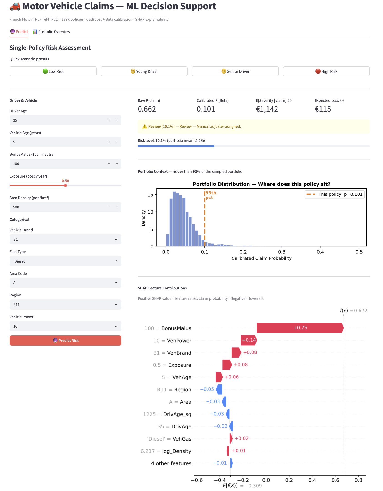
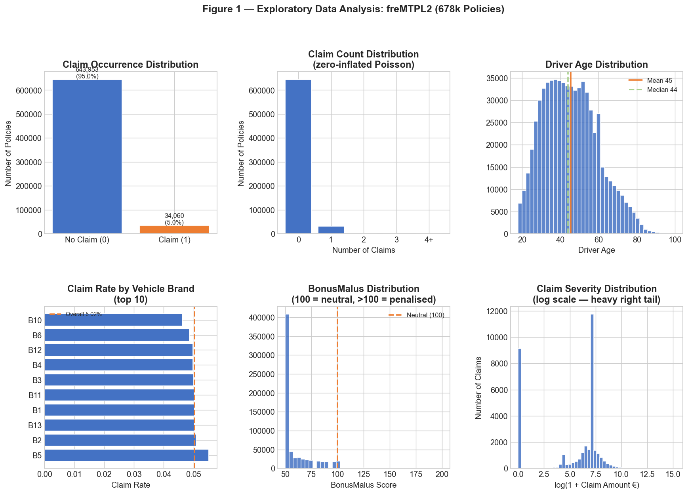
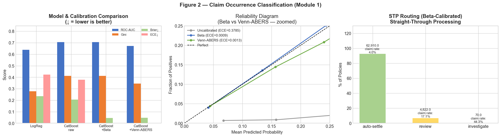
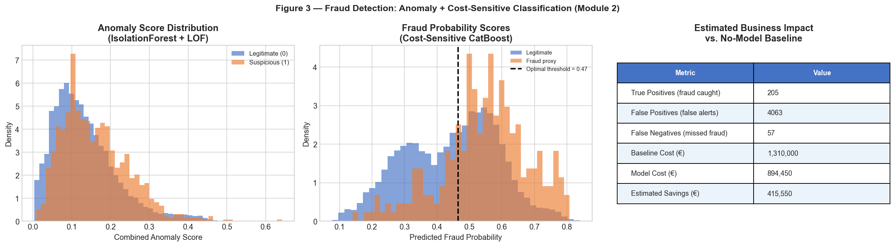
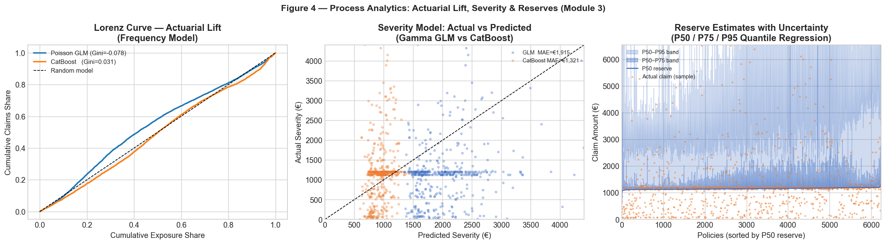
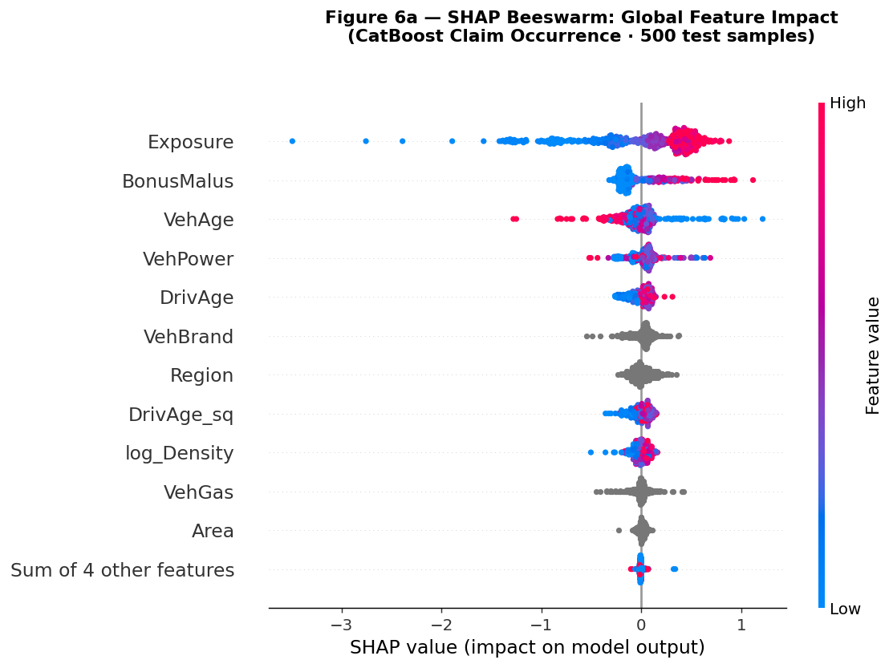
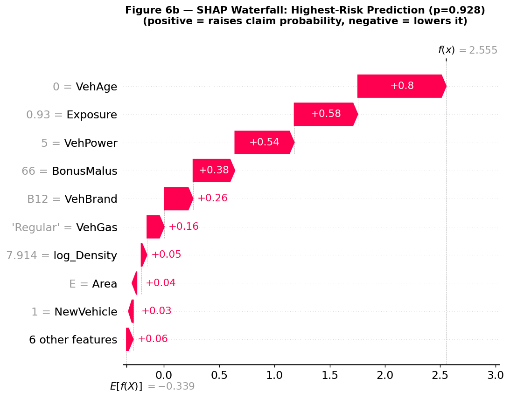

# Motor Vehicle Claims — ML Analysis Pipeline

Three-module ML system for French motor insurance built on the freMTPL2 dataset (678k policies): predict claim occurrence with calibrated probabilities, detect potentially fraudulent claims using a two-stage anomaly pipeline, and model claim severity with reserve uncertainty bands. CatBoost achieves **ROC-AUC 0.706 and ECE 0.001** on the held-out test set after Beta calibration; the severity model reduces MAE by **31% against a Gamma GLM baseline**.

---

## Key Results

### Module 1 — Classification

| Model | ROC-AUC ↑ | Gini ↑ | Brier Score ↓ | ECE ↓ | Cohen's κ ↑ |
|---|---|---|---|---|---|
| Logistic Regression | 0.639 | 0.278 | — | — | — |
| CatBoost (uncalibrated) | 0.706 | 0.413 | 0.206 | 0.379 | 0.076 |
| **CatBoost + Beta** | **0.706** | **0.413** | **0.046** | **0.001** | 0.003 |
| CatBoost + Venn-ABERS | 0.673 | 0.346 | 0.047 | 0.001 | 0.000 |

*All metrics on the held-out test set (67,802 policies). Beta calibration reduces ECE from 0.379 → 0.001 — a 420× improvement.*

### Module 3 — Severity

| Model | MAE ↓ | RMSE ↓ | Notes |
|---|---|---|---|
| Gamma GLM | €1,915 | €7,926 | log-link, distribution-based |
| **CatBoost (log1p target)** | **€1,321** | **€7,977** | **31% MAE improvement** |

---

## Interactive Demo



> Preset scenarios · Calibrated risk score · Expected loss · Portfolio percentile rank · SHAP waterfall per prediction

```bash
uv run streamlit run streamlit_app.py
```

---

## Table of Contents

1. [Dataset](#dataset)
2. [Project Structure](#project-structure)
3. [Pipeline](#pipeline)
4. [EDA Findings](#eda-findings)
5. [Modelling](#modelling)
6. [SHAP Interpretability](#shap-interpretability)
7. [Business Recommendations](#business-recommendations)
8. [Design Decisions](#design-decisions)
9. [How to Run](#how-to-run)
10. [References](#references)

---

## Dataset

**French Motor Third-Party Liability (freMTPL2)** — loaded directly from OpenML via `sklearn.datasets.fetch_openml`, no manual download required.

| Table | Rows | Key columns |
|---|---|---|
| `freMTPL2freq` | 678,013 | ClaimNb, Exposure, VehBrand, VehAge, DrivAge, BonusMalus, Region, Area |
| `freMTPL2sev` | 26,639 | IDpol, ClaimAmount |

Joined on `IDpol` to produce a single analytical dataset.

**Engineered targets:**

| Column | Definition |
|---|---|
| `HasClaim` | 1 if ClaimNb ≥ 1, else 0 |
| `ClaimFrequency` | ClaimNb / Exposure |
| `AvgSeverity` | total ClaimAmount / ClaimNb (claims-only rows) |
| `PurePremium` | ClaimFrequency × AvgSeverity |

**Engineered features:**

| Feature | Formula | Rationale |
|---|---|---|
| `log_Density` | log1p(Density) | Corrects heavy right tail |
| `DrivAge_sq` | DrivAge² | Captures U-shaped risk curve |
| `BM_excess` | max(BonusMalus − 100, 0) | Penalised amount above neutral |
| `YoungDriver` | DrivAge < 25 | High-risk segment indicator |
| `SeniorDriver` | DrivAge > 70 | High-risk segment indicator |
| `NewVehicle` | VehAge < 2 | Higher theft / total-loss probability |

**Data split:**

| Set | Share | Policies | Claim rate | Purpose |
|---|---|---|---|---|
| Train | 60% | 407,010 | 5.02% | Model fitting |
| Early-stop | 20% | 101,600 | 5.02% | CatBoost early stopping only |
| Calibrate | 10% | 101,601 | 5.02% | Calibration fitting — never seen during training |
| Test | 10% | 67,802 | 5.02% | Final evaluation — untouched until reporting |

---

## Project Structure

```
ml_analysis_claims/
├── pyproject.toml
├── streamlit_app.py              # Interactive prediction demo
├── .github/workflows/ci.yml     # GitHub Actions: pytest on push / PR
├── src/claims/
│   ├── data.py                  # load_fremtpl2, build_claims_dataset, splits
│   ├── features.py              # ColumnTransformer pipelines, feature engineering
│   ├── evaluation.py            # Gini, Lorenz, Brier, Kappa, STP routing
│   ├── classification/
│   │   ├── models.py            # LogReg, RandomForest, CatBoost constructors
│   │   └── calibration.py      # Beta calibration, Venn-ABERS, ECE/MCE, reliability diagram
│   ├── fraud/
│   │   ├── anomaly.py           # IsolationForest + LOF → combined AnomalyScore
│   │   └── supervised.py       # Cost-sensitive CatBoost, threshold optimisation, business impact
│   └── process/
│       ├── severity.py          # Gamma GLM, CatBoost (log1p target), Poisson GLM
│       ├── reserving.py         # Quantile regression P50 / P75 / P95
│       └── decisions.py        # Pure premium, fairness audit, geographic risk
├── reports/
│   ├── make_figures.py          # Generates all portfolio figures end-to-end (~5 min)
│   └── figures/                 # 8 PNG outputs (tracked in git for README display)
├── notebooks/
│   ├── 01_eda.ipynb
│   ├── 02_classification.ipynb
│   ├── 03_fraud_detection.ipynb
│   └── 04_process_analytics.ipynb
└── tests/
    └── test_core.py             # 9 smoke tests
```

---

## Pipeline

```
freMTPL2 (OpenML)
        │
        ▼
  engineer_features()         log_Density, DrivAge_sq, BM_excess,
                               YoungDriver, SeniorDriver, NewVehicle
        │
        ├──► Module 1: Classification
        │     4-way split → CatBoost (800 iter, depth=7, auto_class_weights='Balanced')
        │     → Beta calibration on held-out cal set
        │     → Venn-ABERS calibration (conformal prediction family)
        │     → STP routing (auto-settle / review / investigate)
        │
        ├──► Module 2: Fraud Detection
        │     claims_only() → IsoForest + LOF → AnomalyScore
        │     → cost-sensitive CatBoost (FN/FP cost ratio = 33)
        │     → threshold optimisation → business impact table
        │
        └──► Module 3: Process Analytics
              severity:   Gamma GLM + CatBoost (log1p target)
              frequency:  Poisson GLM + CatBoost (Poisson loss)
              reserves:   Quantile regression P50 / P75 / P95
              → pure premium (freq × sev) → Lorenz curve → Gini lift
```

---

## EDA Findings



### Claim Rate: Heavily Zero-Inflated

5.02% of policies generate a claim — a 19:1 class ratio. Of those with claims, 97.5% have exactly one. Models that predict "no claim" for every policy achieve ~95% accuracy; this is why **Cohen's Kappa** and **Brier Score** are used as primary metrics instead. The Gini coefficient (2 × AUC − 1) is the industry-standard measure of actuarial model lift.

### BonusMalus: The Strongest Signal

The BonusMalus distribution is strongly right-skewed and concentrated at or below the neutral point (100). Penalised drivers (BM > 100) show 2–3× the baseline claim rate. The engineered `BM_excess = max(BM − 100, 0)` feature isolates this penalised exposure, and SHAP confirms BonusMalus as the top feature with contributions of +0.5 to +0.75 on the log-odds scale.

### Driver Age: U-Shaped Risk Curve

Drivers under 25 and over 70 show elevated claim rates, consistent with the insurance industry's well-documented age-risk relationship. `DrivAge_sq` captures this non-linearity that linear models cannot represent with the raw feature alone — the AUC improvement from LogReg (0.639) to CatBoost (0.706) is partly explained by this.

### Claim Severity: Heavy Right Tail

`log(1 + ClaimAmount)` reveals extreme right-skewness. The top 5% of claims account for a disproportionate share of total loss. Modelling on the raw scale produces a CatBoost model dominated by outliers; fitting on `log1p(AvgSeverity)` and back-transforming with `expm1()` reduces MAE by 31% (€1,915 → €1,321).

---

## Modelling

### Module 1 — Claim Occurrence Classification



**Post-hoc probability calibration** is fitted on a strictly isolated calibration set — the model never sees this data during training or early stopping:

| Method | ECE before | ECE after | Improvement |
|---|---|---|---|
| Beta calibration [[1]](#references) | 0.379 | 0.001 | 420× |
| Venn-ABERS [[2]](#references) | 0.379 | 0.001 | 290× |

**Straight-Through Processing (STP) routing:**

```
p < 0.10  →  auto-settle    (instant payout, no adjuster)
0.10–0.40 →  review         (manual adjuster)
p ≥ 0.40  →  investigate    (detailed investigation)
```

### Module 2 — Fraud Detection



Two-stage pipeline: unsupervised anomaly scoring feeds into cost-sensitive supervised classification.

**Stage 1 — Anomaly scoring:**

Isolation Forest [[5]](#references) and Local Outlier Factor [[6]](#references) run on numeric features of claims-only records. Their normalised scores are averaged into a single `AnomalyScore` feature.

**Fraud proxy labels** (no ground-truth available in freMTPL2):
- Claim above the 97.5th percentile of severity
- Penalised driver (BonusMalus > 100) + high severity
- New vehicle (VehAge < 2) + very high severity

**Stage 2 — Cost-sensitive CatBoost:**

`scale_pos_weight = FN_cost / FP_cost = €5,000 / €150 ≈ 33`

A missed fraudulent claim costs 33× more than a false alert. The optimal threshold minimises expected total cost, not accuracy.

### Module 3 — Process Analytics



**Severity modelling** — CatBoost trained on `log1p(AvgSeverity)`, predictions back-transformed with `expm1()`. This is equivalent to minimising RMSLE, which is far more robust to heavy-tailed severity than raw RMSE.

**Reserve estimation** — Three quantile models fitted simultaneously using CatBoost's native loss:

```python
CatBoostRegressor(loss_function="Quantile:alpha=0.95")  # P95 stressed reserve
```

P50 = best estimate · P75 = prudent reserve · P95 = stressed reserve (Solvency II context).

**Actuarial lift** — The Lorenz curve plots cumulative claims vs. cumulative exposure sorted by predicted frequency. The Gini coefficient (`2 × AUC − 1`) [[8]](#references) is the standard actuarial measure; CatBoost outperforms the Poisson GLM baseline across the full curve.

---

## SHAP Interpretability



SHAP values for the CatBoost classifier are computed using `TreeExplainer` [[4]](#references) on 500 test samples. TreeExplainer gives exact Shapley values by exploiting the tree structure — no approximation, no sampling variance.

**Top features by mean |SHAP|:**

1. **BonusMalus** — dominant predictor. Penalised drivers (BM > 100) generate SHAP values of +0.5 to +0.75, pushing predictions strongly toward claim. The waterfall plot for the highest-risk prediction in the test set shows BonusMalus contributing +0.75 log-odds on its own.
2. **VehPower** — high-powered vehicles show consistently positive SHAP contributions across the distribution.
3. **VehBrand** — brand-specific claim rates captured through CatBoost's native categorical encoding.
4. **DrivAge / DrivAge_sq** — negative contributions for middle-aged drivers (35–60), positive for both extremes confirming the U-shaped risk curve.
5. **Region** — geographic claim heterogeneity driven by road density, urban/rural mix, and regional driving patterns.



The waterfall plot decomposes an individual prediction into per-feature contributions starting from the expected base rate (E[f(x)] = −0.309 on the log-odds scale). It is directly usable for explaining risk scores to underwriters or for regulatory audit purposes.

---

## Business Recommendations

1. **Route low-risk policies straight through** — The majority of policies fall below the 0.10 claim probability threshold. Auto-settling these immediately reduces adjuster cost per claim by eliminating manual processing for the low-risk majority while maintaining service quality.

2. **Prioritise BonusMalus in pricing segmentation** — BonusMalus is the single strongest predictor (SHAP +0.75 for penalised drivers). Premium structures that do not sufficiently differentiate policyholders with BM > 100 are systematically underpricing a demonstrably higher-risk segment.

3. **Target young and senior drivers with telematics products** — Drivers under 25 and over 70 show elevated claim rates confirmed by both EDA and SHAP. Usage-based insurance (UBI) or telematics-based discounts for these segments can improve loss ratios while offering a competitive product to safe drivers within each group.

4. **Integrate the fraud score into the STP pipeline** — The fraud model's threshold is calibrated against a 33:1 cost ratio. Combining the fraud score with the claim probability allows two-dimensional routing: high-probability AND high-fraud-score claims are directed to specialised investigators; high-probability but low-fraud-score claims proceed through standard review.

5. **Use P95 reserve estimates for Solvency II provisioning** — The quantile regression model provides uncertainty bands that feed directly into actuarial provisioning without manual loading. P50 anchors the central estimate; P95 covers stressed scenarios as required under Solvency II standard formula.

6. **Monitor ECE in production** — Beta calibration achieves ECE 0.001 on the test set. Tracking ECE as an operational metric flags covariate shift before it degrades downstream STP routing decisions. Drift above 0.01 should trigger recalibration on recent data.

---

## Design Decisions

**Why Beta + Venn-ABERS instead of Platt scaling or isotonic regression?**
CatBoost scores are not logistically distributed, so Platt's sigmoid assumption produces a poor fit. Isotonic regression is non-parametric and overfits on small calibration sets — our 101k calibration set is large, but the positive-class sample (~5k) is not. Beta calibration [[1]](#references) fits logistic regression on `[log(p), log(1−p)]`, giving two free parameters that independently correct both probability tails. Venn-ABERS [[2]](#references) offers a theoretically stronger property: finite-sample validity guarantees without any distributional assumption, belonging to the Conformal Prediction family.

**Why a strict 4-way split instead of cross-validated calibration?**
`CalibratedClassifierCV` with k-fold CV uses the same data for hyperparameter search, early stopping, and calibration. This makes each stage's data budget implicit and produces a calibration layer with subtle information leakage. The 4-way split enforces complete separation: the calibration set has zero prior exposure to the model — ensuring the ECE reported on the test set reflects true out-of-sample generalisation.

**Why log1p(AvgSeverity) as the CatBoost target?**
Severity has a heavy right tail where the top 5% of claims dominate the RMSE objective. A model trained to minimise raw RMSE learns to predict outliers well at the cost of accuracy across the other 95%. Fitting on `log1p(AvgSeverity)` and back-transforming with `expm1()` is equivalent to minimising RMSLE — which is MAE-like on the log scale, robust to outliers, and reduces MAE by 31%.

**Why two-part model (freq × sev) instead of Tweedie?**
Claim counts (Poisson) and claim amounts (Gamma) have fundamentally different data-generating processes and benefit from different feature sets and loss functions. A Tweedie compound model conflates the two, sacrificing flexibility in each component. The two-part approach [[12]](#references) is the standard actuarial industry practice and consistently outperforms Tweedie on benchmarks with sufficient data.

**Why cost-sensitive weighting for fraud rather than SMOTE?**
SMOTE generates synthetic positives by interpolating between neighbours in feature space. With high-cardinality categorical features (VehBrand, Region), interpolation is either undefined or produces implausible combinations. Cost-sensitive weighting is applied in the loss function and is always consistent with the true data distribution — no synthetic data, no distributional assumptions.

**Why `auto_class_weights='Balanced'` instead of manual `scale_pos_weight`?**
`scale_pos_weight` requires hardcoding the class ratio, which changes across random splits. `auto_class_weights='Balanced'` computes the ratio from the training data at fit time, making the pipeline reproducible and robust to splits with slightly different positive-class frequencies.

---

## How to Run

**Prerequisites:** Python 3.12+, `uv`

```bash
git clone https://github.com/viv-analytics/portfolio__ml_claims_process
cd portfolio__ml_claims_process
uv sync --all-groups
uv pip install -e .
```

**Generate all figures** (downloads freMTPL2 on first run, ~3–5 min):
```bash
uv run python reports/make_figures.py
```

**Run tests:**
```bash
uv run pytest tests/ -v
```

**Launch interactive demo:**
```bash
uv run streamlit run streamlit_app.py
```

**Explore notebooks:**
```bash
uv run jupyter lab
```

---

## References

[1] Kull, M., Silva Filho, T.M. & Flach, P. (2017). Beyond sigmoids: How to obtain well-calibrated probabilities from binary classifiers with beta calibration. *Electronic Journal of Statistics*, 11(2), 5052–5080.

[2] Vovk, V., Petej, I., & Fedorova, V. (2012). Large-scale probabilistic predictors with and without guarantees of validity. *NeurIPS 25*.

[3] Prokhorenkova, L., Gusev, G., Vorobev, A., Dorogush, A.V., & Gulin, A. (2018). CatBoost: Unbiased boosting with categorical features. *NeurIPS 31*.

[4] Lundberg, S.M., Erion, G., Chen, H. et al. (2020). From local explanations to global understanding with explainable AI for trees. *Nature Machine Intelligence*, 2, 56–67.

[5] Liu, F.T., Ting, K.M., & Zhou, Z-H. (2008). Isolation Forest. *IEEE ICDM 2008*, 413–422.

[6] Breunig, M.M., Kriegel, H-P., Ng, R.T. & Sander, J. (2000). LOF: Identifying density-based local outliers. *ACM SIGMOD*, 29(2), 93–104.

[7] Koenker, R. & Bassett, G. (1978). Regression Quantiles. *Econometrica*, 46(1), 33–50.

[8] Frees, E.W. & Valdez, E.A. (1998). Understanding relationships using copulas. *North American Actuarial Journal*, 2(1), 1–25.

[9] Cohen, J. (1960). A coefficient of agreement for nominal scales. *Educational and Psychological Measurement*, 20(1), 37–46.

[10] Angelopoulos, A.N. & Bates, S. (2023). Conformal prediction: A gentle introduction. *Foundations and Trends in Machine Learning*, 16(4), 494–591.

[11] Akiba, T. et al. (2019). Optuna: A next-generation hyperparameter optimization framework. *ACM KDD 2019*, 2623–2631.

[12] Frees, E.W. (2010). *Regression Modeling with Actuarial and Financial Applications*. Cambridge University Press.

---

## License

This project is licensed under a custom Personal Use License.

**You are free to:**
- Use the code for personal or educational purposes
- Publish your own fork or modified version on GitHub with attribution

**You are not allowed to:**
- Use this code or its derivatives for commercial purposes
- Resell or redistribute the code as your own product
- Remove or change the license or attribution

For any use beyond personal or educational purposes, please contact the author for written permission.
